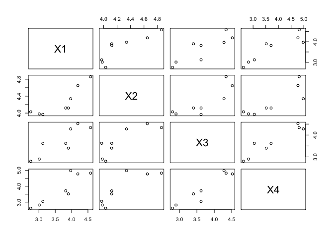

Aula 01
================

[Gravação da Aula
01](https://drive.google.com/file/d/1_ilykBsFdumWUR0nIw4zkF5dInzUDbVI/view?usp=drivesdk)

## Módulo 1 - Vetores Aleatórios

### 1.1 - Variável Aleatória

### 1.2 - Vetor Aleatório

### 1.3 - Vetor de médias

### 1.4 - Variância e Desvio Padrão

fornece informação sobre a dispersão dos valores da variável em relação
à respectiva média

### 1.5 - Covariâncias

grau de relacionamento linear entre duas variáveis

quanto menor em módulo (mais próximo a zero) = as variáveis estão menos
associadas -\> variáveis independentes

negativa: variam em sentidos opostos

matriz simétrica

#### 1.5.1 - Variância Total

soma dos elementos da diagonal principal da matriz de Covariâncias

#### 1.5.2 - Variância Generalizada

raiz quadrada do determinante da matriz de covariâncias

### 1.6 - Correlação

relacionamento linear entre duas variáveis

valor em módulo, quanto mais próximo de 1, maior a associação entre as
variáveis

varia de -1 a 1

linear de Pearson

diagonal da matriz = 1

### 1.7 - Teorema da decomposição espectral

obter matrizes que multiplicadas originam a matriz de covariâncias (
$\Sigma$ )

matriz ortogonal: multiplicada por ela mesmma na forma transposta,
resulta na matriz identidade (diagonal principal composta por 1, o
restante por 0)

#### 1.7.1 - autovalores:

- diagonal principal são ordenados em ordem decrescente
- $\lambda$

#### 1.7.2 - autovetor (ou vetor característico)

- associado a cada $\lambda$
- colunas da matriz O

``` r
# Exemplo
```

``` r
# Importação dos dados

#install.packages("readxl")
library(readxl)

coxinha <- read_excel("coxinha.xlsx")

summary(coxinha) # resumo numérico
```

    ##        X1              X2              X3              X4       
    ##  Min.   :2.750   Min.   :3.970   Min.   :2.800   Min.   :2.620  
    ##  1st Qu.:3.092   1st Qu.:4.018   1st Qu.:3.275   1st Qu.:2.993  
    ##  Median :3.860   Median :4.120   Median :3.620   Median :3.615  
    ##  Mean   :3.667   Mean   :4.259   Mean   :3.685   Mean   :3.786  
    ##  3rd Qu.:4.025   3rd Qu.:4.418   3rd Qu.:4.295   3rd Qu.:4.782  
    ##  Max.   :4.580   Max.   :4.860   Max.   :4.520   Max.   :4.980

``` r
# Matriz de Covariâncias Amostral (S)

S <- cov(coxinha)
S
```

    ##           X1        X2        X3        X4
    ## X1 0.4069071 0.1822107 0.3573571 0.5504750
    ## X2 0.1822107 0.1104411 0.1796357 0.2713804
    ## X3 0.3573571 0.1796357 0.4242000 0.5897357
    ## X4 0.5504750 0.2713804 0.5897357 0.9105696

``` r
# Matriz de Correlações

R <- cor(coxinha)
R
```

    ##           X1        X2        X3        X4
    ## X1 1.0000000 0.8595298 0.8601407 0.9043434
    ## X2 0.8595298 1.0000000 0.8299311 0.8557689
    ## X3 0.8601407 0.8299311 1.0000000 0.9488892
    ## X4 0.9043434 0.8557689 0.9488892 1.0000000

``` r
# Gráficos de Dispersão
plot(coxinha)
```

<!-- -->

## Módulo 2 - Estimação de Parâmetros em Distribuições Multivariadas

## Módulo 3 - Análise de Componentes Principais
